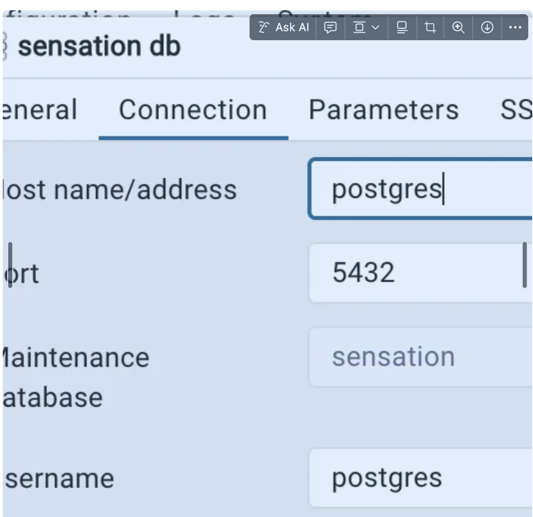

# База данных на сервере

Давай сделаем пошаговую инструкцию для **установки PostgreSQL 15 на домашнем сервере** для тестового k3s-кластера, с учётом того, что ты будешь работать через SSH со своего рабочего компьютера.

---

## 1️⃣ Создаём каталоги для данных и бэкапов

На сервере:

```bash
mkdir -p ~/postgres/data
mkdir -p ~/postgres/backups
```

- `~/postgres/data` → тут PostgreSQL будет хранить свои данные (volume).
- `~/postgres/backups` → сюда будут складываться дампы для резервного копирования.

---

## 2️⃣ Создаём `docker-compose.yml`

В той же папке (`~/postgres`) создаём файл `docker-compose.yml`:

```yaml
version: "3.9"

services:
  postgres:
    image: postgres:15
    container_name: sensation-postgres
    restart: unless-stopped
    ports:
      - "9432:5432"
    environment:
      POSTGRES_USER: postgres
      POSTGRES_PASSWORD: postgres
      POSTGRES_DB: sensation
    volumes:
      - ./data:/var/lib/postgresql/data
      - ./backups:/backups

  pgadmin:
    image: dpage/pgadmin4:latest
    container_name: pgadmin
    restart: unless-stopped
    environment:
      PGADMIN_DEFAULT_EMAIL: admin
      PGADMIN_DEFAULT_PASSWORD: admin
    ports:
      - "9433:80"
```

---

## 3️⃣ Запуск PostgreSQL и PgAdmin

На сервере:

```bash
cd ~/postgres
docker compose up -d
```

Проверяем, что контейнеры работают:

```bash
docker ps
```

- PostgreSQL будет слушать порт `9432`.
- PgAdmin будет доступен на `http://<IP_сервера>:9433`.

---

## 4️⃣ Создание бэкапа базы

На сервере можно сделать дамп всей базы:

```bash
docker exec -t sensation-postgres pg_dumpall -U prod_user > ~/postgres/backups/full_backup.sql
```

- Файл `full_backup.sql` можно скачать на рабочий компьютер через `scp`.

---

## 5️⃣ Восстановление из бэкапа

```bash
cat ~/postgres/backups/full_backup.sql | docker exec -i sensation-postgres psql -U prod_user
```

---

## 6️⃣ Безопасность (для домашнего сервера)

- Если не хочешь открывать PostgreSQL всем в сети, ограничь доступ через firewall:

```bash
sudo ufw allow from <IP_твоего_рабочего_компа> to any port 9432
sudo ufw deny 9432
```

# Как подключиться:

## 1️⃣ Подключение к PostgreSQL

Ты пробросила порт 5432 контейнера на **9432** хоста:

```yaml
ports:
  - "9432:5432"
```

### Варианты подключения:

### a) Через psql на сервере

Если на сервере установлен `psql`:

```bash
psql -h localhost -p 9432 -U postgres -d sensation
```

- `h localhost` → хост контейнера (локальный сервер)
- `p 9432` → порт на сервере, который проброшен на контейнер
- `U postgres` → пользователь
- `d sensation` → база данных

Тебя попросят ввести пароль: `postgres`.

---

### b) Через psql с твоего рабочего компьютера

Если сервер доступен по SSH/IP, и ты хочешь подключаться с рабочей машины:

```bash
psql -h <IP_сервера> -p 9432 -U postgres -d sensation
```

> Если у тебя домашний интернет с динамическим IP и роутером, лучше использовать SSH-туннель вместо прямого проброса порта.
> 
> 
> Например:
> 

```bash
ssh -L 5432:localhost:9432 user@<IP_сервера>
psql -h localhost -p 5432 -U postgres -d sensation
```

- Тогда локально порт 5432 будет пересылать на сервер, безопасно через SSH.

---

## 2️⃣ Подключение к PgAdmin

Ты пробросила порт 80 контейнера на **9433** хоста:

```yaml
ports:
  - "9433:80"
```

- На рабочем компьютере открой браузер:

```
http://<IP_сервера>:9433
```

- Логин: `admin@example.com`
- Пароль: `adminpassword`

После входа в PgAdmin можно добавить сервер PostgreSQL:

- **Host name/address**: `localhost` (если работаешь с SSH-туннелем) или IP сервера (если прямой доступ)
- **Port**: 5432 (или 9432, если подключаешься напрямую)
- **Maintenance database**: `sensation`
- **Username/Password**: `postgres / postgres`

Если мы подключаемся через pgadmin то нужно при подключении сервера набирать те порты и значения которые внутри контейнера а не снаружи
