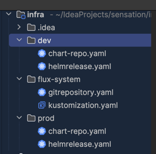

# Запуск приложения на сервере

Cервер + Kubernetes + Helm + FluxCD + GitHub. Всё бесплатное и приближенное к «проду».

---

## 1. Подготовка сервера

На сервере (Linux, root доступ):

```bash
# Обнови пакеты
sudo apt update && sudo apt upgrade -y

# Поставь docker (нужен для сборки и запуска контейнеров)
curl -fsSL https://get.docker.com | sh
# Добавляем своего пользователя в группу docker чтобы заходить без sudo (после этой команды нужно перезайти в сессию чтобы она применилась)
sudo usermod -aG docker $USER

```

Выйди и зайди снова, чтобы применились права.

---

## 2. Установка Kubernetes (k3s)

Самый удобный вариант для одного сервера — **k3s** (лёгкая дистрибуция Kubernetes).

```bash
curl -sfL https://get.k3s.io | sh -
curl -sfL https://get.k3s.io | sh -s - server --write-kubeconfig-mode 644
(иначе мы не сможем читать конфиги не из под рут)

```

Чтобы читать конфиги не только из под рута (не сработало или надо вручную писать в башрц - не проверяла)

```jsx
export KUBECONFIG=/etc/rancher/k3s/k3s.yaml
```

Проверка:

```bash
kubectl get nodes
```

👉 K3s установит `kubectl` и настроит его конфиг.

---

## 3. Установка Helm

```bash
curl https://raw.githubusercontent.com/helm/helm/main/scripts/get-helm-3 | bash
helm version

```

---

## 4. Установка FluxCD (GitOps оператор)

FluxCD будет следить за GitHub репо и применять конфиги.

```bash
curl -s https://fluxcd.io/install.sh | sudo bash
flux --version

```

Установим FluxCD в кластер:

```bash
mkdir -p ~/.kube
sudo cp /etc/rancher/k3s/k3s.yaml ~/.kube/config
sudo chown $(id -u):$(id -g) ~/.kube/config
```

```bash
flux install
kubectl get pods -n flux-system
```

Вот что делает команда: `sudo chown $(id -u):$(id -g) ~/.kube/config`

Разберём по частям:

- `chown` → **change owner** (сменить владельца файла).
- `$(id -u)` → подставляет **uid** (числовой идентификатор твоего пользователя).
- `$(id -g)` → подставляет **gid** (идентификатор твоей группы).
- `~/.kube/config` → тот файл, у которого мы меняем владельца.

Зачем это нужно?

Файл `/etc/rancher/k3s/k3s.yaml` создаётся от **root**, и когда ты копируешь его в свой `~/.kube/config` с помощью `sudo cp`, он по умолчанию всё ещё принадлежит root.

Если этого не исправить:

- `kubectl` (или `flux`) не сможет читать конфиг,
- или придётся всегда запускать `kubectl` с `sudo`, что неудобно.

Поэтому мы говорим системе: «Сделай владельцем этого файла **мой текущий пользователь** и его основную группу».

В итоге ты сможешь работать с кластером как обычный пользователь, без `sudo`.

---

## 5. Создание репозиториев на GitHub

1. [`my-app`](https://github.com/belkanaphan-sensation/tournament-ss) — код приложения + Dockerfile.
2. [`my-charts`](https://github.com/belkanaphan-sensation/chart) — Helm Chart.
3. [`my-infra`](https://github.com/belkanaphan-sensation/infra) — описание HelmRelease (GitOps)

---

## 6. Сборка и публикация Docker-образа

В репозитории `my-app` создаёшь `Dockerfile`.

```bash
# Этап сборки
FROM eclipse-temurin:23-jdk-alpine AS build

WORKDIR /app

COPY build.gradle settings.gradle ./
COPY gradlew .
COPY gradle ./gradle
COPY src ./src

RUN chmod +x gradlew
RUN ./gradlew build -x test

# Финальный образ
FROM eclipse-temurin:23-jdk-alpine

WORKDIR /app
COPY --from=build /app/build/libs/*.jar app.jar

EXPOSE 8080

ENTRYPOINT ["java", "-jar", "app.jar"]
```

Собираешь образ и пушишь в **GitHub Container Registry (GHCR)**:

```bash
# Сборка Docker-образа с указанием нужной для сервера платформы
docker build --platform linux/amd64 -t ghcr.io/belkanaphan-sensation/tournament-ss:0.0.1-SNAPSHOT .

# Логин в GHCR
echo $CR_PAT | docker login ghcr.io -u belkanaphan --password-stdin

# Пуш образа в GHCR
docker push ghcr.io/belkanaphan-sensation/tournament-ss:0.0.1-SNAPSHOT
```

👉 `$CR_PAT` = GitHub Personal Access Token с правами `write:packages`.

**Сборка образа**

```bash
docker build -t ghcr.io/<github-username>/<app-name>:v1 .
```

🔹 Что здесь происходит:

- `docker build` — собираем Docker-образ.
- `t ghcr.io/...` — даём ему тег (название).
    - `ghcr.io` → это реестр GitHub (GitHub Container Registry).
    - `<github-username>` → твой GitHub логин.
    - `<app-name>` → название твоего приложения/репозитория.
    - `:v1` → версия (тег). Можно использовать `:latest`.
- `.` → путь к `Dockerfile` (точка = текущая папка).

После выполнения у тебя будет локальный образ.

**Авторизация в GHCR**

```bash
echo $CR_PAT | docker login ghcr.io -u <github-username> --password-stdin
```

🔹 Что происходит:

- GitHub требует **персональный токен (PAT)** для загрузки в GHCR.
- `$CR_PAT` — это переменная окружения, в которой хранится твой токен.
    - Его нужно создать заранее в [GitHub → Settings → Developer settings → Personal access tokens → Tokens (classic)](https://github.com/settings/tokens).
    - Выбрать `write:packages`, `read:packages`, `delete:packages`.
- `docker login ghcr.io` — логинимся в реестр.
- `-password-stdin` — безопасно передаём токен в докер.

Если всё ок, получишь сообщение: Login Succeeded

**Отправка образа в GHCR**

```bash
docker push ghcr.io/<github-username>/<app-name>:v1
```

🔹 Здесь ты:

- Отправляешь собранный образ в GitHub Container Registry.
- После этого образ хранится в GitHub, и его можно использовать:
    - На твоём сервере (`docker pull ghcr.io/<username>/<app-name>:v1`)
    - В Kubernetes (в `Deployment.yaml`)

---

## 7. Подключение Flux к репозиторию infra


---

Т.е. чарт накодится в гите, то нам нужно именно gitrepository а не helmrepository

```bash
#flux-system/gitrepository
# GitRepository
apiVersion: source.toolkit.fluxcd.io/v1
kind: GitRepository
metadata:
  name: infra
  namespace: flux-system
spec:
  interval: 1m
  url: https://github.com/belkanaphan-sensation/infra

----
#flux-system/kustomization
# Kustomization
apiVersion: kustomize.toolkit.fluxcd.io/v1
kind: Kustomization
metadata:
  name: infra
  namespace: flux-system
spec:
  interval: 1m
  path: "./prod"
  prune: true
  sourceRef:
    kind: GitRepository
    name: infra

----
#prod/chart-repo
apiVersion: source.toolkit.fluxcd.io/v1
kind: GitRepository
metadata:
  name: chart-repo
  namespace: flux-system
spec:
  interval: 1m
  url: https://github.com/belkanaphan-sensation/chart

```

### Если репозитории публичные

Ничего дополнительно делать не нужно 🚀 Flux сам их клонирует по HTTPS.

---

### Если репозитории приватные (не проверяла)

Тогда надо создать секрет с SSH-ключом или токеном GitHub.

Например, если используешь SSH:

1. На сервере сгенерируй ключ (если нет):
    
    ```bash
    ssh-keygen -t ed25519 -C "flux@yourdomain" -f ./flux-key -N ""
    ```
    
2. Закоммить в GitHub → Settings → Deploy keys → добавить `flux-key.pub` как **Deploy key с правом read**.
3. В k8s создай секрет:
    
    ```bash
    kubectl create secret generic flux-git-deploy \
      --from-file=identity=./flux-key \
      -n flux-system
    ```
    
4. В GitRepository укажи:
    
    ```yaml
    spec:
      url: ssh://git@github.com/belkanaphan-sensation/infra
      secretRef:
        name: flux-git-deploy
    ```
    

### Проверка, что Flux всё видит

```bash
kubectl get gitrepositories -n flux-system
kubectl describe gitrepository infra -n flux-system
```

### Склонировать репозитории (если ещё не сделала)

```bash
git clone https://github.com/belkanaphan-sensation/chart.git
git clone https://github.com/belkanaphan-sensation/infra.git
```

---

На сервере (где будет prod)

### 2. Перейти в папку с манифестами `infra`

У тебя в `infra` лежат `flux-system/gitrepository.yaml`, `prod/chart-repo.yaml`, `prod/helmrelease.yaml` и т.д.

Перейди туда:

```bash
cd infra
```

---

### 3. Применить `GitRepository` и `Kustomization`

Перед этим вручную создать все необходимые нэимспейсы

```bash
kubectl create namespace prod
```

Это нужно, чтобы Flux начал синхронизироваться с GitHub (или локальной копией, если укажешь `file://`).

```bash
kubectl apply -f flux-system/
kubectl apply -f prod/
```

---

### 4. Проверить, что ресурсы создались

```bash
kubectl get gitrepositories -n flux-system
kubectl get kustomizations -n flux-system
kubectl get helmreleases -n prod
```

---

### 5. Если хочешь именно локально применить (обойти Flux)

<aside>
⚠️

Я конкретно это не пробовала, но ранее с примерением чарта у меня не работало, так тчто лучше не делать

</aside>

То можно просто:

```bash
kubectl apply -f chart/templates/   # применить напрямую чарт (как обычные манифесты)
```

или через Helm:

```bash
helm upgrade --install sensation ./chart -n prod --create-namespace -f infra/prod/values.yaml
```

---

⚡ Резюмирую:

- **Через Flux** → `kubectl apply -f flux-system/ && kubectl apply -f prod/`
- **Напрямую (для теста)** → `helm upgrade --install sensation ./chart -n prod -f infra/prod/values.yaml`

---

Здесь уже **разворачивается Kubernetes + Helm**.

1. **Создать секрет для доступа к GHCR в необходимом неимспейсе**

Тут мы CR_PAT просто вписываем в команду, без добавления в переменные окружения  кубер его запонминает

```bash
kubectl create secret docker-registry ghcr-secret \
  --docker-server=ghcr.io \
  --docker-username=<твой-гитхаб-логин> \
  --docker-password=<CR_PAT> \
  --docker-email=<email> \
-n prod
```

- Это нужно **только на сервере**, чтобы kubelet мог подтянуть приватный образ.
1. **Настроить HelmRelease / values.yaml в инфре**
- В `values.yaml` указываем имя образа и секрет:

```yaml
tournament:
  enabled: true
  image: ghcr.io/belkanaphan-sensation/tournament-ss:0.0.1-SNAPSHOT
  imagePullSecrets:
    - name: ghcr-secret

```

1. **Деплой через Helm (или FluxCD) это если делается после применения изменений**

```bash
helm upgrade --install tournament ./chart -f values.yaml
```

- Kubernetes подтянет образ с GHCR используя секрет `ghcr-secret`.

Чтобы под мог подключиться к базе данных нужно прописат не **`localhost:9432`**, а через IP/Service `192.168.1.89:9432`:

1. `localhost` внутри пода — это сам под. Он не видит Docker-контейнер на хосте.
2. Порт 9432 проброшен на хосте, но поды Kubernetes не подключаются к нему напрямую через `localhost`.

Нужно подключать под к **доступной базе данных в кластере** или через IP/Service. Есть несколько вариантов:

---

### Вариант 1: Перенести Postgres в Kubernetes

Создаёшь `Deployment` и `Service` для Postgres, чтобы твой backend видел его через имя сервиса:

```yaml
apiVersion: v1
kind: Service
metadata:
  name: postgres
  namespace: prod
spec:
  ports:
    - port: 5432
      targetPort: 5432
  selector:
    app: postgres
```

Backend подключается как:

```
jdbc:postgresql://postgres:5432/sensation
```

---

### Вариант 2: Использовать внешний IP хоста

Если хочешь оставить Docker-контейнер на хосте, backend в поде должен подключаться **к IP хоста**, например `192.168.1.89:9432`, а не `localhost`.

В values.yaml для HelmRelease указываешь:

```yaml
tournament:
  env:
    - name: SPRING_DATASOURCE_URL
      value: jdbc:postgresql://192.168.1.89:9432/sensation
```

⚠️ Тут важно, чтобы firewall/iptables на хосте разрешал подключения с подов Kubernetes к порту 9432.

---

### Вариант 3: Использовать Port Forwarding (для локальной разработки)

```bash
kubectl port-forward pod/<pod-name> 5432:5432
```

Но это временное решение и не подходит для прод.

---

# Swagger

Чтобы открыть Swagger на рабочем компьютере, нужно пробросить порт из Kubernetes пода наружу. Так как под у тебя в кластере K3s на домашнем сервере, есть несколько вариантов:

---

### **1️⃣ Через `kubectl port-forward` (самый быстрый способ)**

На рабочем компьютере подключись к серверу через SSH и пробрось порт:

```bash
ssh -L 8080:localhost:8080 elena@<IP_домашнего_сервера>

```

Здесь:

- `8080` — порт на твоем рабочем компьютере (можешь выбрать другой, если занят)
- `<IP_домашнего_сервера>` — IP домашнего сервера

Затем локально пробрось порт до пода через kubectl:

```bash
kubectl port-forward pod/tournament-<SUFFIX> 8080:8080 -n prod

```

- `tournament-<SUFFIX>` — имя пода (можно посмотреть через `kubectl get pods -n prod`)
- `8080:8080` — проброс внутреннего порта приложения на локальный порт

Теперь открой в браузере на рабочем компьютере:

```
http://localhost:8080/swagger-ui.html
```

или

```
http://localhost:8080/swagger
```

в зависимости от конфигурации приложения.

---

### **2️⃣ Через NodePort/LoadBalancer (для постоянного доступа)**

Если хочешь, чтобы Swagger был доступен напрямую по IP сервера:

В `Service` приложения выставь тип `NodePort`:

```yaml
apiVersion: v1
kind: Service
metadata:
  name: tournament-service
  namespace: prod
spec:
  type: NodePort
  selector:
    app: tournament
  ports:
    - protocol: TCP
      port: 8080
      targetPort: 8080
      nodePort: 30080   # порт на сервере

```

После применения (`kubectl apply -f service.yaml`) Swagger будет доступен по:

```
http://<IP_домашнего_сервера>:30080/swagger

```

---

Если хочешь, я могу прямо написать **команды для твоего текущего пода и namespace**, чтобы открыть Swagger на рабочем компьютере через `kubectl port-forward`.

Хочешь, чтобы я это сделал?

# Другое

### Удаление K3S

для удаления k3s с сервера/главного узла:

```
sudo /usr/local/bin/k3s-uninstall.sh
```

для удаления k3s с агента/рабочего узла:

```
sudo /usr/local/bin/k3s-agent-uninstall.sh
```

---